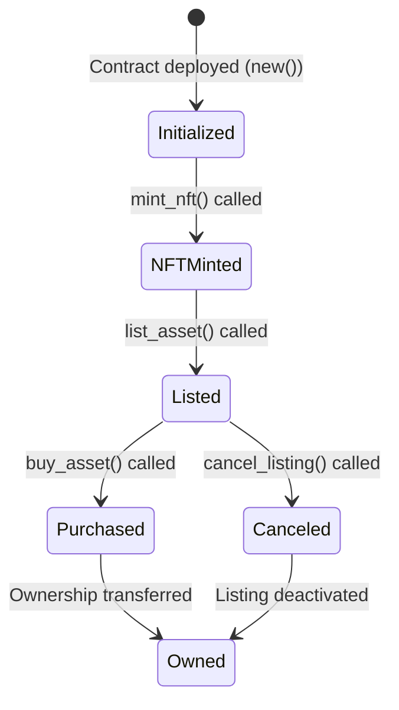
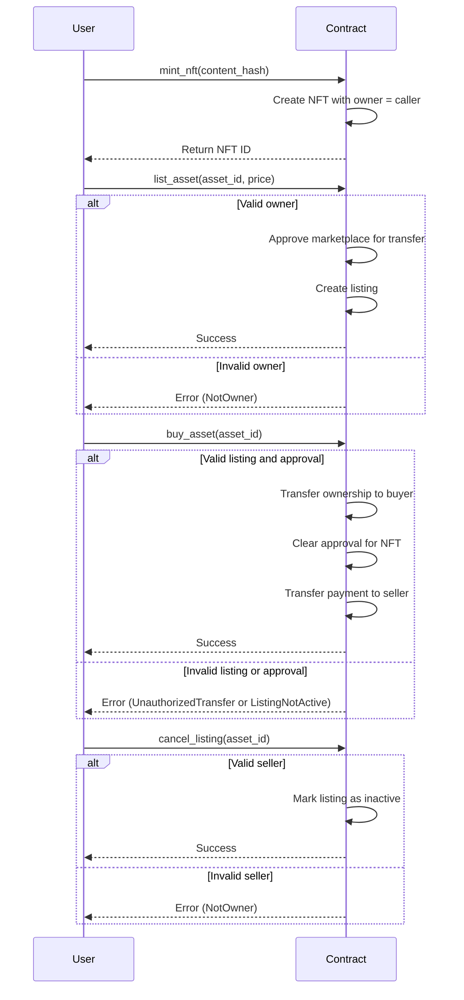

# A simple NFT MarketPlace

This contract implements a decentralized NFT marketplace where users can list, buy, and manage NFTs. It provides a secure mechanism for transferring ownership of NFTs during a sale and ensures that only authorized accounts can perform specific actions.

## Key Features

| Feature                          | Description                                                              |
|----------------------------------|--------------------------------------------------------------------------|
| **NFT Minting**                  | Users can mint unique NFTs with a content hash                           |
| **NFT Listing**                  | Owners can list their NFTs for sale with a specified price               |
| **NFT Purchase**    | Ownership of NFTs is securely transferred to the buyer upon purchase     |
| **Approval Mechanism**           | Ensures only approved accounts (e.g., the marketplace) can transfer NFTs |
| **Listing Management**           | Owners can cancel active listings at any time                            |

## Data Structures

| Component             | Type                         | Description                                                         |
|-----------------------|------------------------------|---------------------------------------------------------------------|
| **Content**           | `struct`                     | Represents an NFT with its owner, content hash, and approval status |
| **Listing**           | `struct`                     | Represents an NFT listing with price, seller, and active status     |
| **Error**             | `enum`                       | Custom error types for contract operations                          |
| **NFTMarketplace**    | `struct`                     | The main storage structure of the contract                          |

## Functions Overview

### `new()` - Initializes the Contract

- **Key Points:**
  - Sets up the contract with default values for storage  

### `mint_nft(content_hash: String)` - Mints a New NFT

- **Key Points:**  
  - Creates a new NFT with a unique content hash  
  - Assigns the caller as the owner  

### `approve(asset_id: u64, approved: AccountId)` - Approves an Account

- **Key Points:**  
  - Allows the owner to approve an account to transfer the NFT  
  - Used internally to approve the marketplace for handling sales  

### `list_asset(asset_id: u64, price: Balance)` - Lists an NFT for Sale

- **Key Points:**  
  - Verifies the caller is the owner of the NFT  
  - Approves the marketplace to transfer the NFT  
  - Creates a listing with the specified price  

### `buy_asset(asset_id: u64)` - Buys an NFT

- **Key Points:**  
  - Verifies the listing is active and the marketplace is approved  
  - Transfers ownership of the NFT to the buyer  
  - Transfers the payment to the seller  

### `cancel_listing(asset_id: u64)` - Cancels an Active Listing

- **Key Points:**  
  - Verifies the caller is the seller  
  - Marks the listing as inactive  

### `get_content(asset_id: u64)` - Retrieves NFT Details

- **Key Points:**  
  - Returns the details of an NFT, including its owner and approval status  

### `get_listing(asset_id: u64)` - Retrieves Listing Details

- **Key Points:**  
  - Returns the details of an active listing  

## State Diagram

## Sequence Diagram

